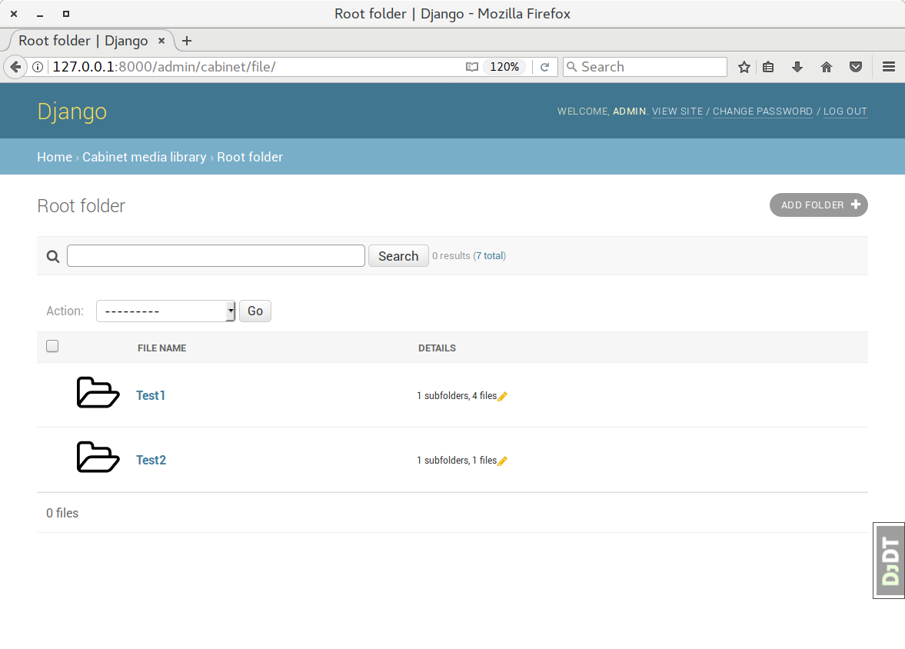
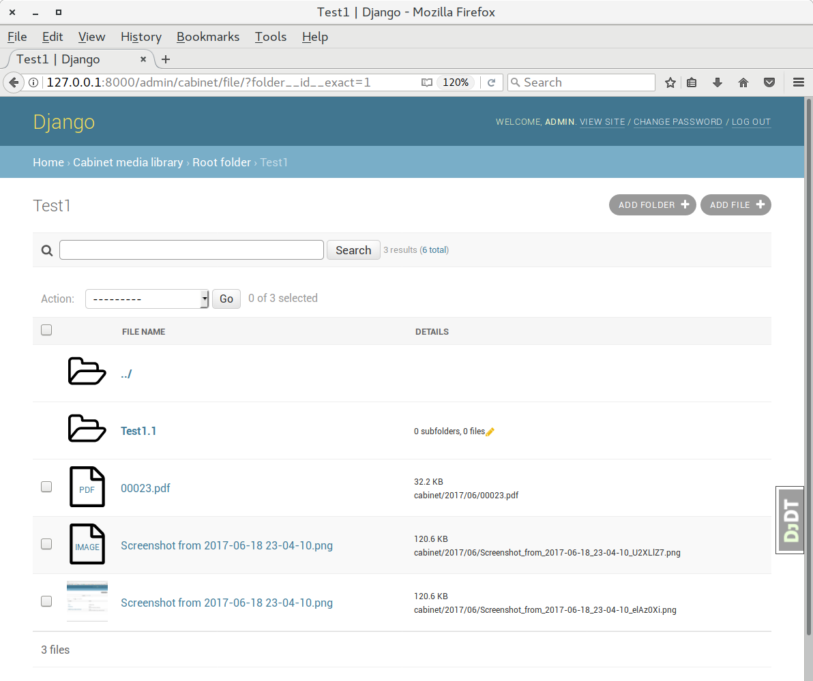
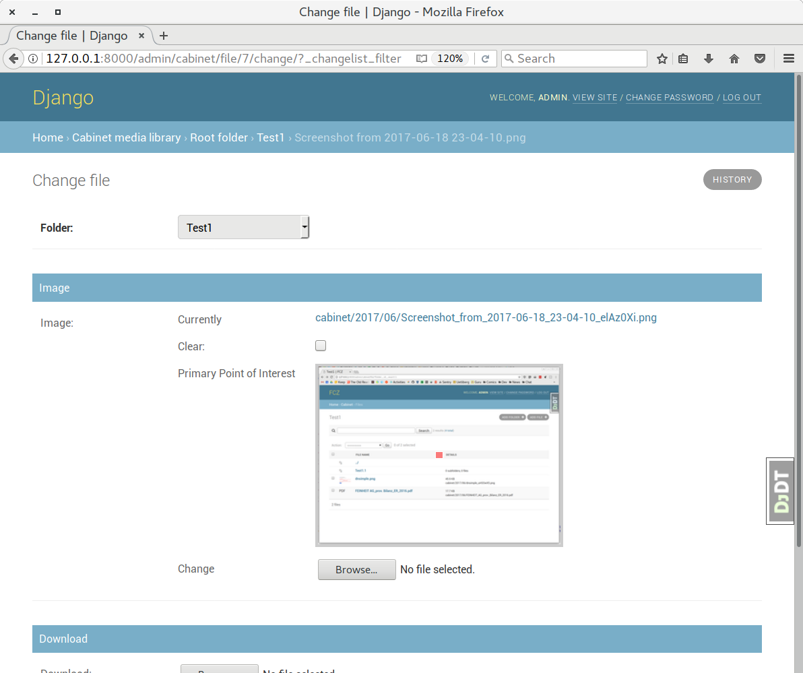

=========================================
django-cabinet - Media library for Django
=========================================

Version |release|

django-cabinet is a media library for Django implemented while trying to
write as little code as possible to keep maintenance at a minimum. At
the time of writing the projects consists of less than 1000 lines of
code (excluding tests), but still offers hierarchical folders,
downloads, images with primary point of interest (courtesy of
django-versatileimagefield_) and drag-drop uploading of files directly
into the folder view.

Screenshots
===========

   List of root folders

   Folder view with subfolders and files

   File details with primary point of interest

Installation
============

- ``pip install django-cabinet``
- Add ``cabinet`` and ``versatileimagefield`` to your ``INSTALLED_APPS``
- Maybe replace the file model by setting ``CABINET_FILE_MODEL``, but the
  default should be fine for most uses.

High-level overview
===================

django-cabinet comes with two concrete models, ``cabinet.File`` and
``cabinet.Folder``.

**Folders** can be nested into a hierarchy. The folder
tree intentionally uses an adjacency list model without any query
optimization strategies (such as nested sets or recursive CTEs) so that
no dependencies are necessary.

**Files** by default have two file fields, one for images based on
django-versatileimagefield_ and one for downloads, a standard Django
``FileField``. Exactly one field has to be filled in. Files can only be
added to folders; files can never exist in the root folder.

Replacing the file model
========================

The file model is swappable, and should be easy to replace if you
require additional or different functionality. If, for example, you'd
want to move all PDFs to a different storage, build on the following
example code.

First, ``models.py``::

    from django.db import models
    from django.utils.translation import ugettext_lazy as _

    from cabinet.base import AbstractFile, ImageMixin, DownloadMixin

    class PDFMixin(models.Model):
        pdf_file = models.FileField(
            _('pdf'),
            upload_to=...,
            storage=...,
            blank=True,
        )

        class Meta:
            abstract = True

        # Cabinet requires a accept_file method on all mixins which
        # have a file field:
        def accept_file(self, value):
            if value.name.lower().endswith('.pdf'):
                self.pdf_file = value
                return True

    class File(AbstractFile, ImageMixin, PDFMixin, DownloadMixin):
        FILE_FIELDS = ['image_file', 'pdf_file', 'download_file']

        # Add caption and copyright, makes FileAdmin reuse easier.
        caption = models.CharField(
            _('caption'),
            max_length=1000,
            blank=True,
        )
        copyright = models.CharField(
            _('copyright'),
            max_length=1000,
            blank=True,
        )

        # Add additional fields if you want to.

Next, ``admin.py``::

    # You do not have to build on top of FileAdmin, but if there's no
    # good reason not to it's probably much less work. If not, you
    # still should take a long look at cabinet.base_admin.FileAdminBase

    from django.contrib import admin

    from cabinet.admin import FileAdmin as _FileAdmin

    from .models import File

    @admin.register(File)
    class FileAdmin(_FileAdmin):
        # list_display / list_display_links are probably fine if you
        # built on top of AbstractFile and added caption/copyright
        # fields, otherwise there is additional work to do.

        # You **have** to override this, or else you won't see the
        # pdf_file field of existing files:
        def get_fieldsets(self, request, obj=None):
            if obj and obj.image_file.name:
                return [(None, {'fields': (
                    'folder', 'image_file', 'caption', 'image_alt_text',
                    'copyright',
                )})]

            elif obj and obj.pdf_file.name:
                return [(None, {'fields': (
                    'folder', 'pdf_file', 'caption', 'copyright',
                )})]

            elif obj and obj.download_file.name:
                return [(None, {'fields': (
                    'folder', 'download_file', 'caption', 'copyright',
                )})]

            else:
                return [
                    (None, {'fields': (
                        'folder', 'caption', 'copyright',
                    )}),
                    (_('Image'), {'fields': (
                        'image_file', 'image_alt_text',
                    )}),
                    (_('PDF'), {'fields': (
                        'pdf_file',
                    )}),
                    (_('Download'), {'fields': (
                        'download_file',
                    )}),
                ]

Last, add ``CABINET_FILE_MODEL = 'yourapp.File'`` to your Django
settings.

.. include:: ../CHANGELOG.rst

.. _django-versatileimagefield: https://django-versatileimagefield.readthedocs.io/
